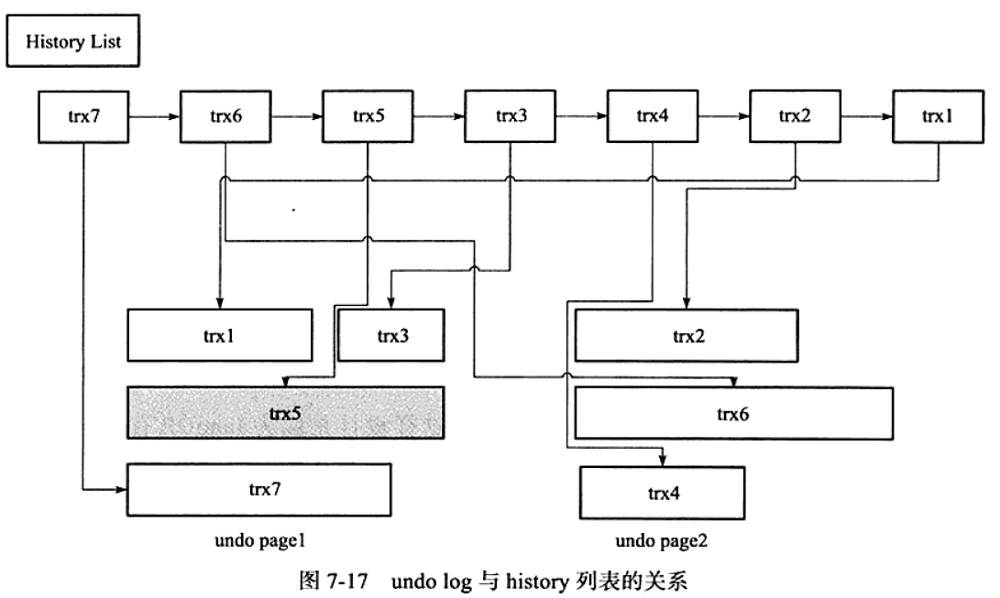

# 事务

事务：一个事务内的语句，要么全部执行成功，要么全部执行失败。

事务的特性：

* 原子性（atomicity）：整个数据库事务是不可分割的工作单位。
* 一致性（consistency）：事务将数据库从一种状态转变为下一种一致的状态。
* 隔离性（isolation）：每个读写事务的对象对其他对象的操作对象能相互分离，即该事务提交前对其他事务都不可见。通常使用锁来实现。
* 持久性（durability）：事务一旦提交，其结果是永久性的。即使发生宕机等故障，数据库也能将数据恢复。

Tip: 并不是所有的数据库都严格满足以上四个特性。比如MySQL中的NDB Cluster引擎，虽然支持事务，但不满足D的要求。Oracle数据库，默认隔离级别为READ COMMITED，不满足I的要求。InnoDB存储引擎，默认REPEATABLE READ，完全遵循和满足事务的ACID特性。

## 事务并发执行时可能出现的现象

* P1\(脏读\)： 事务可以读取未提交的数据
* P2\(不可重复读\)：两次执行相同的查询，可能会得到不一样的结果。
* P3\(幻读\)：当某个事务在读取某个范围内的记录时，另一个事务又在该范围内插入了新的记录，当之前的事务再次读取该范围的记录时，会产生幻行。

## 隔离级别

### READ UNCOMMITED\(未提交读\)

一个事务还没提交时，它做的变更就能被别的事务看到。

### READ COMMITED\(提交读\)

一个事务提交之后，它做的变更才会被其他事务看到。

### REPEATABLE READ\(可重复读\)

一个事务执行过程中看到的数据，总是跟这个事务在启动时看到的数据是一致的。当然在可重复读隔离级别下，未提交变更对其他事务也是不可见的。

SQL标准中定义，可重复读隔离级别，幻读问题仍可能存在。但是在InnoDB引擎RR隔离级别中，通过next key locking 解决了幻读问题。这个地方比较有争议，高性能MySQL一书中说是多版本并发控制\(mvvc\)，InnoDB存储引擎一书说next key locking，最后在官网盖章确认是next key locking。

### SERIALIZABLE\(串行化\)

顾名思义是对于同一行记录，“写”会加“写锁”，“读”会加“读锁”。当出现读写锁冲突的时候，后访问的事务必须等前一个事务执行完成，才能继续执行。

 

## 事务的实现

在 MySQL 中，实际上每条记录在更新的时候都会同时记录一条回滚操作。记录上的最新值，通过回滚操作，都可以得到前一个状态的值。 

Q: 什么时候可以删除undo日志？

A: 当系统里没有比这个回滚日志更早的 read-view 的时候

建议： 尽量不要使用长事务

长事务意味着系统里面会存在很老的事务视图。由于这些事务随时可能访问数据库里面的任何数据，所以这个事务提交之前，数据库里面它可能用到的回滚记录都必须保留，这就会导致大量占用存储空间。

### redo

InnoDB中，通过Force Log at commit机制实现事务的持久性，即当事务提交时，必须先将该事务的所有日志写入到重做日志文件进行持久化，待事务的commit操作完成才算完成。

重做日志：在InnoDB中由redo log 和undo log组成。

* redo log保证事务持久性，undo log用于事务回滚和MVCC。
* redo log基本上是顺序写，在数据库运行时不需要对redo log的文件进行读取操作。undo log需要随机读写。

为了确保每次日志都写入重做日志文件，在每次将重做日志缓冲写入重做日志文件后，InnoDB存储引擎都需要调用一次fsync操作。

参数innodb\_flush\_log\_at\_trx\_commit：控制重做日志刷新到磁盘的策略。默认值1，表示事务提交时必须调用一次fsync操作。0表示事务提交时不进行写入重做日志操作,master thread每一秒进行一次fsync操作。2表示事务提交时将重做日志写入重做日志文件，但仅写入文件系统的缓存中，不进行fsync操作。

redo log buffer\(0\) &gt; file system page cache\(2\) &gt; 磁盘\(1\)

### undo

* 回滚操作

  对数据库进行修改时，InnoDB存储引擎不但会产生redo，还会产生一定量的undo。如果用户执行的事务或者语句由于某种原因失败了，又或者用户用ROLLBACK语句请求回滚，就可以利用undo信息将数据回滚到修改之前的样子。

  undo所做的恢复非物理恢复，仅仅将数据库逻辑恢复到原来的样子。数据结构和页本身在回滚后可能不同。

* MVCC

  InnoDB存储引擎中MVCC的实现时通过undo来实现的。当用户读取一行记录时，若该记录已经被其他事务占用，当前事务可以通过undo读取之前的行版本信息，以此实现非锁定读取。

下面是redo log + undo log的简化过程，便于理解两种日志的过程：

假设有A、B两个数据，值分别为1,2。

1. 事务开始
2. 记录A=1到undo log
3. 修改A=3
4. 记录A=3到 redo log
5. 记录B=2到 undo log
6. 修改B=4
7. 记录B=4到redo log
8. 将redo log写入磁盘
9. 事务提交

   实际上，在insert/update/delete操作中，redo和undo分别记录的内容都不一样，量也不一样。在InnoDB内存中，一般的顺序如下：

写undo的redo 写undo 修改数据页 写Redo

### purge

delete和update操作并不直接删除原有的数据，purge用于最终完成delete和update操作。原因：InnoDB存储引擎支持MVCC，记录不能再事务提交时立即进行处理。其他事务可能正在引用这行，因此需要保存记录之前的版本。

若该行记录已经不被其他事务引用，那么就可以由purge进行真正的delete操作。 

## 事务的启动方式

1. 显式启动事务语句， begin 或 start transaction。配套的提交语句是 commit，回滚语句是 rollback。
2. set autocommit=0，这个命令会将这个线程的自动提交关掉。意味着如果你只执行一个 select 语句，这个事务就启动了，而且并不会自动提交。这个事务持续存在直到你主动执行 commit 或 rollback 语句，或者断开连接。

建议：总是使用 set autocommit=1, 通过显式语句的方式来启动事务

commit work and chain 语法：提交事务并自动启动下一个事务，这样也省去了再次执行 begin 语句的开销。同时带来的好处是从程序开发的角度明确地知道每个语句是否处于事务中。

## 参考文献

1. 高性能MySQL（第三版）
2. MySQL技术内幕：InnoDB存储引擎（第2版）
3. SQL标准: [https://www.wiscorp.com/sql20nn.zip](https://www.wiscorp.com/sql20nn.zip)
4. InnoDB next key locking: [https://dev.mysql.com/doc/refman/5.7/en/innodb-next-key-locking.html](https://dev.mysql.com/doc/refman/5.7/en/innodb-next-key-locking.html)
5. [http://catkang.github.io/2018/08/31/isolation-level.html](http://catkang.github.io/2018/08/31/isolation-level.html)
6. [https://segmentfault.com/a/1190000017888478](https://segmentfault.com/a/1190000017888478)

