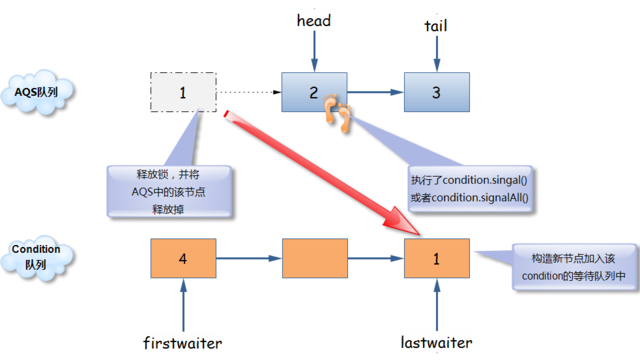

# Condition

## Condition接口

```java
    // 当前线程进入等待状态直到被通知（signal）或中断。
    // 与此条件相关联的锁被原子释放，当前线程因线程调度目的变得不可用，处于休眠状态直到以下情况发生：
    // 1. 其他线程调用这个条件的signal方法，并且当前线程被选中为被唤醒的线程
    // 2. 其他线程调用了这个条件的signalAll方法
    // 3. 其他线程中断当前线程，并且支持线程中断暂停
    // 4. 发生了虚假唤醒
    // 如果当前等待线程从await方法返回，那么表示该线程已经获取了Condition对象所对应的锁
    void await() throws InterruptedException;

    // 当前线程进入等待状态直到被通知，忽略中断
    void awaitUninterruptibly();

    // 当前线程进入等待状态直到被通知、中断或者超时。返回值表示剩余时间
    long awaitNanos(long nanosTimeout) throws InterruptedException;

    // 当前线程进入等待状态直到被通知、中断或者到某个时间。如果没有到指定时间就被通知，方法返回true，否则返回false
    boolean awaitUntil(Date deadline) throws InterruptedException;

    // 唤醒一个等待在Condition上的线程，该线程从等待方法返回前必须获得与Condition相关联的锁
    void signal();

    // 唤醒等待在Condition上的所有线程，从等待方法返回的线程必须获得与Condition相关联的锁
    void signalAll();
```

## ConditionObject

ConditionObject是AQS中的一个内部类，因为Condition的操作需要获取相关联的锁。

```java
        /** First node of condition queue. */
        private transient Node firstWaiter;
        /** Last node of condition queue. */
        private transient Node lastWaiter;
```



### await

```java
        /**
         * Implements interruptible condition wait.
         * <ol>
         * <li> If current thread is interrupted, throw InterruptedException.
         * <li> Save lock state returned by {@link #getState}.
         * <li> Invoke {@link #release} with saved state as argument,
         *      throwing IllegalMonitorStateException if it fails.
         * <li> Block until signalled or interrupted.
         * <li> Reacquire by invoking specialized version of
         *      {@link #acquire} with saved state as argument.
         * <li> If interrupted while blocked in step 4, throw InterruptedException.
         * </ol>
         */
        public final void await() throws InterruptedException {
            // 如果当前线程被中断，抛出中断异常
            if (Thread.interrupted())
                throw new InterruptedException();
            // 把当前线程节点加入到Condition队列
            Node node = addConditionWaiter();
            // 释放锁
            int savedState = fullyRelease(node);
            int interruptMode = 0;
            // 这里为啥要判断在没在同步队列里
            // signal操作会将Node从Condition队列中拿出并且放入到等待队列中去，在不在AQS等待队列就看signal是否执行了
            // 如果不在AQS等待队列中，就park当前线程，如果在，就退出循环，这个时候如果被中断，那么就退出循环
            while (!isOnSyncQueue(node)) {
                LockSupport.park(this);
                if ((interruptMode = checkInterruptWhileWaiting(node)) != 0)
                    break;
            }
            // 5.这个时候线程已经被signal()或者signalAll()操作给唤醒了，退出了4中的while循环
            // 自旋等待尝试再次获取锁，调用acquireQueued方法
            if (acquireQueued(node, savedState) && interruptMode != THROW_IE)
                interruptMode = REINTERRUPT;
            if (node.nextWaiter != null) // clean up if cancelled
                unlinkCancelledWaiters();
            if (interruptMode != 0)
                reportInterruptAfterWait(interruptMode);
        }

```

### 添加节点到Condition条件队列

```java

        /**
         * Adds a new waiter to wait queue.
         * @return its new wait node
         */
        private Node addConditionWaiter() {
            Node t = lastWaiter;
            // If lastWaiter is cancelled, clean out.
            if (t != null && t.waitStatus != Node.CONDITION) {
                unlinkCancelledWaiters();
                t = lastWaiter;
            }
            Node node = new Node(Thread.currentThread(), Node.CONDITION);
            if (t == null)
                firstWaiter = node;
            else
                t.nextWaiter = node;
            lastWaiter = node;
            return node;
        }
```


## signal
```java

        /**
         * Moves the longest-waiting thread, if one exists, from the
         * wait queue for this condition to the wait queue for the
         * owning lock.
         *
         * @throws IllegalMonitorStateException if {@link #isHeldExclusively}
         *         returns {@code false}
         */
        public final void signal() {
            // 当前线程是否获取了锁的线程
            if (!isHeldExclusively())
                throw new IllegalMonitorStateException();
            // Condition条件队列里的头节点不为空，唤醒该节点
            Node first = firstWaiter;
            if (first != null)
                doSignal(first);
        }

        
        /**
         * Removes and transfers nodes until hit non-cancelled one or
         * null. Split out from signal in part to encourage compilers
         * to inline the case of no waiters.
         * @param first (non-null) the first node on condition queue
         */
        private void doSignal(Node first) {
            do {
                if ( (firstWaiter = first.nextWaiter) == null)
                    lastWaiter = null;
                first.nextWaiter = null;
            } while (!transferForSignal(first) &&
                     (first = firstWaiter) != null);
        }

        
    /**
     * Transfers a node from a condition queue onto sync queue.
     * Returns true if successful.
     * @param node the node
     * @return true if successfully transferred (else the node was
     * cancelled before signal)
     */
    final boolean transferForSignal(Node node) {
        /*
         * If cannot change waitStatus, the node has been cancelled.
         */
        if (!compareAndSetWaitStatus(node, Node.CONDITION, 0))
            return false;

        /*
         * Splice onto queue and try to set waitStatus of predecessor to
         * indicate that thread is (probably) waiting. If cancelled or
         * attempt to set waitStatus fails, wake up to resync (in which
         * case the waitStatus can be transiently and harmlessly wrong).
         */
        // 将节点从条件队列转移到同步队列
        Node p = enq(node);
        int ws = p.waitStatus;
        if (ws > 0 || !compareAndSetWaitStatus(p, ws, Node.SIGNAL))
            LockSupport.unpark(node.thread);
        return true;
    }
```

## 参考文献
- 图源：https://blog.csdn.net/coslay/article/details/45217069
