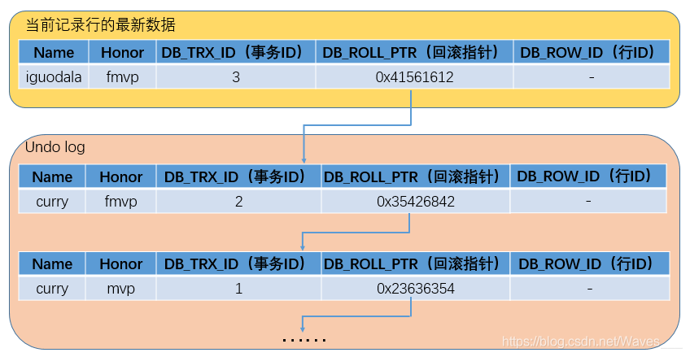

# InnoDB MVCC实现原理

### 1. MVCC背景

MVCC是用于数据库提供并发访问控制的并发控制技术。数据库的并发控制机制有很多，最为常见的就是锁机制。锁机制一般会给竞争资源加锁，阻塞读或者写操作来解决事务之间的竞争条件，最终保证事务的可串行化。而MVCC则引入了另外一种并发控制，它让读写操作互不阻塞，每一个写操作都会创建一个新版本的数据，读操作会从有限多个版本的数据中挑选一个最合适的结果直接返回，由此解决了事务的竞争条件

### 2. InnoDB的MVCC实现

多版本并发控制仅仅是一种技术概念，并没有统一的实现标准， 其的核心理念就是数据快照，不同的事务访问不同版本的数据快照，从而实现不同的事务隔离级别。

MySQL的InnoDB MVCC 的实现依赖：隐藏字段、Read View、Undo log

#### 2.1 隐藏字段

InnoDB存储引擎在每行数据的后面添加了三个[隐藏字段](https://dev.mysql.com/doc/refman/5.7/en/innodb-multi-versioning.html)

1. **DB_TRX_ID(6字节)**：表示最近一次对本记录行作修改（insert | update）的事务ID。对于delete操作，InnoDB认为是一个update操作，会额外更新一个另外的删除位，将行表示为deleted，并非真正物理删除。

2. **DB_ROLL_PTR(7字节)**：回滚指针，指向当前记录行的undo log信息

3. **DB_ROW_ID(6字节)**：随着新行插入而单调递增的行ID。理解：当表没有主键或唯一非空索引时，innodb就会使用这个行ID自动产生聚簇索引。如果表有主键或唯一非空索引，聚簇索引就不会包含这个行ID了。这个DB_ROW_ID跟MVCC关系不大。

#### 2.2 Read view

InnoDB支持的RC（Read Committed）和RR（Repeatable Read）隔离级别是利用consistent read view（一致读视图）方式支持的。 所谓consistent read view就是在某一时刻给事务系统trx_sys打snapshot（快照），把当时trx_sys状态（包括活跃读写事务数组）记下来，之后的所有读操作根据其事务ID（即trx_id）与snapshot中的trx_sys的状态作比较，以此判断read view对于事务的可见性。

Read view中保存的trx_sys状态主要包括

+ **low_limit_id**：目前出现过的最大的事务ID+1，即下一个将被分配的事务ID。high water mark，大于等于view->low_limit_id的事务对于view都是不可见的。
+ **up_limit_id**：活跃事务列表trx_ids中最小的事务ID，如果trx_ids为空，则up_limit_id 为 low_limit_id。low water mark，小于view->up_limit_id的事务对于view一定是可见的
+ **low_limit_no**：trx_no小于view->low_limit_no的undo log对于view是可以purge的
+ **rw_trx_ids**：读写事务数组。Read View创建时其他未提交的活跃事务ID列表。意思就是创建Read View时，将当前未提交事务ID记录下来，后续即使它们修改了记录行的值，对于当前事务也是不可见的。*注意：Read View中trx_ids的活跃事务，不包括当前事务自己和已提交的事务（正在内存中）*

*创建/关闭read view需要持有trx_sys->mutex，会降低系统性能，5.7版本对此进行优化，在事务提交时session会cache只读事务的 read view。下次创建read view 时，判断如果是只读事务并且系统的读写事务状态没有发生变化，即trx_sys的max_trx_id没有向前推进，而且没有新的读写事务产生，就可以重用上次的read view。*

#### 2.3 Undo log

虽然字面上是说具有多个版本的数据快照，但这并不意味着数据库必须拷贝数据，保存多份数据文件，这样会浪费大量的存储空间。

InnoDB通过事务的undo日志巧妙地实现了多版本的数据快照。 当用户读取某条记录被其它事务占用时，当前事务可以通过Undo日志读取到该行之前的数据，以此实现非锁定读取。

数据库的事务有时需要进行回滚操作，这时就需要对之前的操作进行undo。因此，在对数据进行修改时，InnoDB会产生undo log。当事务需要进行回滚时，InnoDB可以利用这些undo log将数据回滚到修改之前的样子。

根据行为的不同 undo log 分为两种 insert undo log和update undo log。

+ **insert undo log**： 是在 insert 操作中产生的 undo log。因为 insert 操作的记录只对事务本身可见，对于其它事务此记录是不可见的，所以 insert undo log 可以在事务提交后直接删除而不需要进行 purge 操作。

+ **update undo log**： 是 update 或 delete 操作中产生的 undo log，因为会对已经存在的记录产生影响，为了提供 MVCC机制，因此 update undo log 不能在事务提交时就进行删除，而是将事务提交时放到入 history list 上，等待 purge 线程进行最后的删除操作。

为了保证事务并发操作时，在写各自的undo log时不产生冲突，InnoDB采用回滚段的方式来维护undo log的并发写入和持久化。回滚段实际上是一种 Undo 文件组织方式。

##### **记录修改的具体流程**

假设有一条记录行如下，字段有Name和Honor，值分别为"curry"和"mvp"，最新修改这条记录的事务ID为1

+ 1.  现在事务A（事务ID为2）对该记录的Honor做出了修改，将Honor改为"fmvp"：
  + 1. 事务A先对该行加排它锁;
  + 2. 然后把该行数据拷贝到undo log中，作为旧版本
  + 3. 拷贝完毕后，修改该行的Honor为"fmvp"，并且修改DB_TRX_ID为2（事务A的ID）, 回滚指针指向拷贝到undo log的旧版本。（然后还会将修改后的最新数据写入redo log）
  + 4. 事务提交，释放排他锁

+ 2. 接着事务B（事务ID为3）修改同一个记录行，将Name修改为"iguodala"
  + 2.1 事务B先对该行加排它锁
  + 2.2 然后把该行数据拷贝到undo log中，作为旧版本
  + 2.3 拷贝完毕后，修改该行Name为"iguodala"，并且修改DB_TRX_ID为3（事务B的ID）, 回滚指针指向拷贝到undo log最新的旧版本
  + 2.4 事务提交，释放排他锁

从上面可以看出，不同事务或者相同事务的对同一记录行的修改，会使该记录行的undo log成为一条链表，undo log的链首就是最新的旧记录，链尾就是最早的旧记录

#### 2.4 可见性算法

Read view创建之后，读数据时比较记录最后更新的trx_id和view的high/low water mark和读写事务数组即可判断可见性。

如前所述，
1）如果记录最新数据是当前事务trx的更新结果，对应当前read view一定是可见的；
2）trx_id < view->up_limit_id的记录对于当前read view是一定可见的；
3）trx_id >= view->low_limit_id的记录对于当前read view是一定不可见的；
4）如果trx_id落在[up_limit_id, low_limit_id)，需要在活跃读写事务数组查找trx_id是否存在：

+ 如果存在，记录对于当前read view是不可见的
+ 反之，则对当前view可见

如果记录对于view不可见，需要通过记录的DB_ROLL_PTR指针遍历history list构造当前view可见版本数据。

##### **RR 与 RC**

1. MVCC只在Repeatable Read 和Read Committed两个事务隔离级别下工作。因为Read Uncommitted 总是读取数据行的最新值，而Serializable 则会对读取的数据行加锁.
2. Read Committed与Repeatable Read 的区别是：在开启事务后进行快照读时，Read Committed能读到最新提交的事务所做的修改；而Repeatable Read 只能读到在事务开启后第一次SELECT读操作之前提交的修改，因此是可重复读.
3.使用READ COMMITTED隔离级别的事务在每次查询开始时都会生成一个独立的 ReadView。REPEATABLE READ 隔离级别下的ReadView在事务开始后第一次读取数据时生成一个ReadView.

### 3 Purge线程

由于InnoDB的二级索引只保存page最后更新的trx_id，当利用二级索引进行查询的时候，如果page的trx_id小于view->up_limit_id，可以直接判断page的所有记录对于当前view是可见的，否则需要回主索引进行判断。

为了实现InnoDB的MVCC机制，更新或者删除操作都只是设置一下旧记录的deleted_bit，并不真正将旧记录删除。为了节省磁盘空间，InnoDB有专门的purge线程来清理deleted_bit为true的记录。purge线程自己也维护了一个read view，如果某个记录的deleted_bit为true，并且DB_TRX_ID相对于purge线程的read_view可见，那么这条记录一定是可以被安全清楚。

### 4 只读事务 (Read-Only transaction)

InnoDB通过如下两种方式来判断一个事务是否为只读事务
１）在InnoDB中通过 start transaction read only 命令来开启，只读事务是指在事务中只允许读操作，不允许修改操作。如果在只读事务中尝试对数据库做修改操作会报错，报错后该事务依然是只读事务，'ERROR 1792 (25006): Cannot execute statement in a READ ONLY transaction.'
２）autocommit 开关打开，并且语句是单条语句，并且这条语句是"non-locking" SELECT 语句，也就是不使用 FOR UPDATE/LOCK IN SHARED MODE 的 SELECT 语句。
优势：１）只读事务避免了为事务分配事务ID(TRX_ID域)的开销；２）对于密集读的场景，可以将一组查询请求包裹在只读事务中，既能提高性能，又能保证查询数据的一致性。

MySQL 5.6对于没有显示指定READ ONLY事务，默认是读写事务，在事务开启时刻分配trx_id和回滚段，并把当前事务加到trx_sys的读写事务数组中。5.7版本对于所有事务默认是只读事务，遇到第一个写操作时，只读事务切换成读写事务分配trx_id和回滚段，并把当前事务加到trx_sys的读写事务组中。
